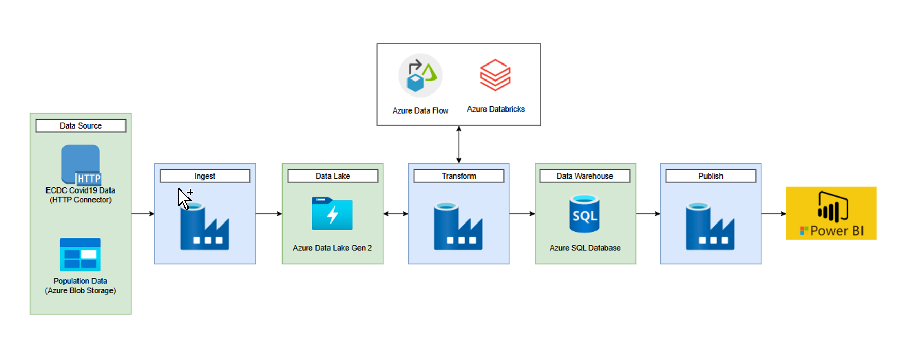
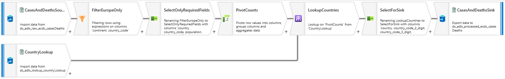
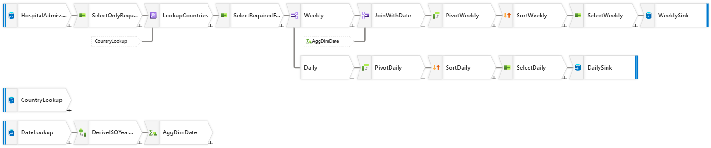
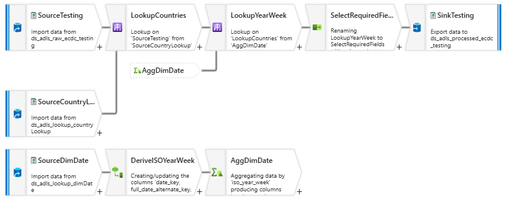
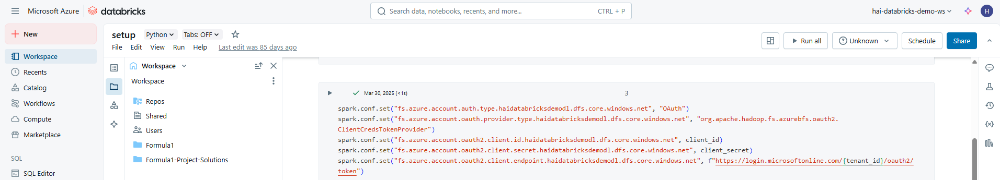
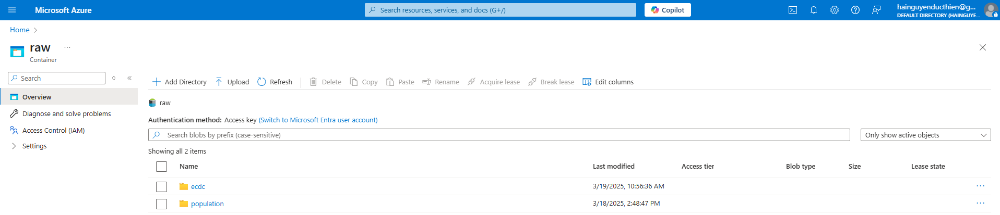
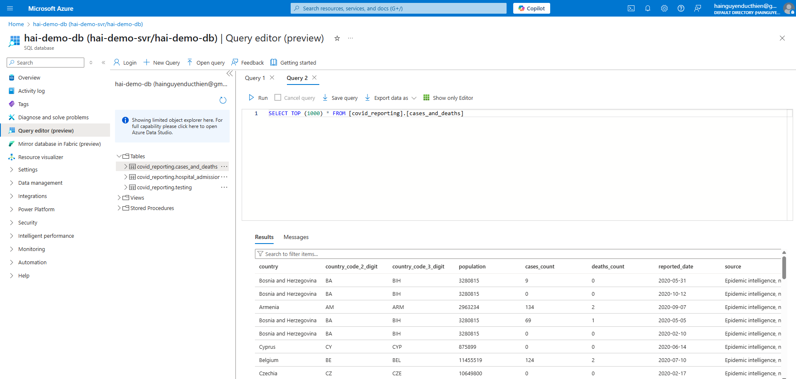
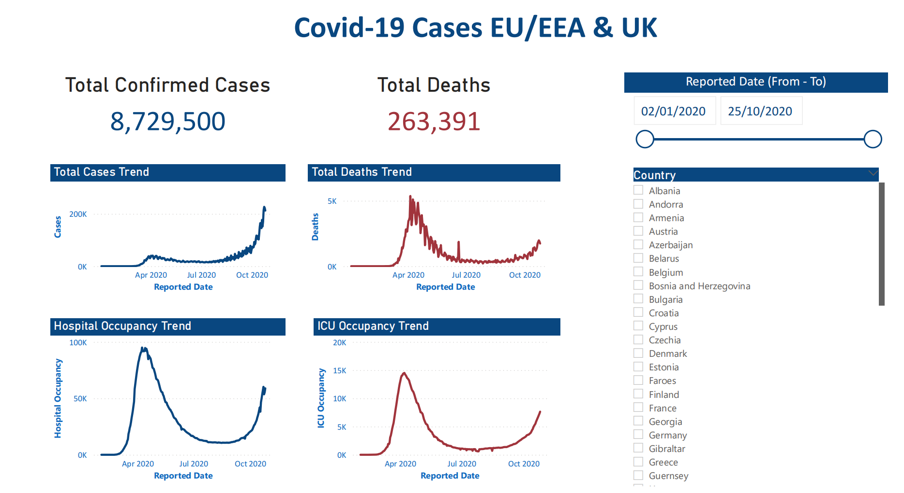
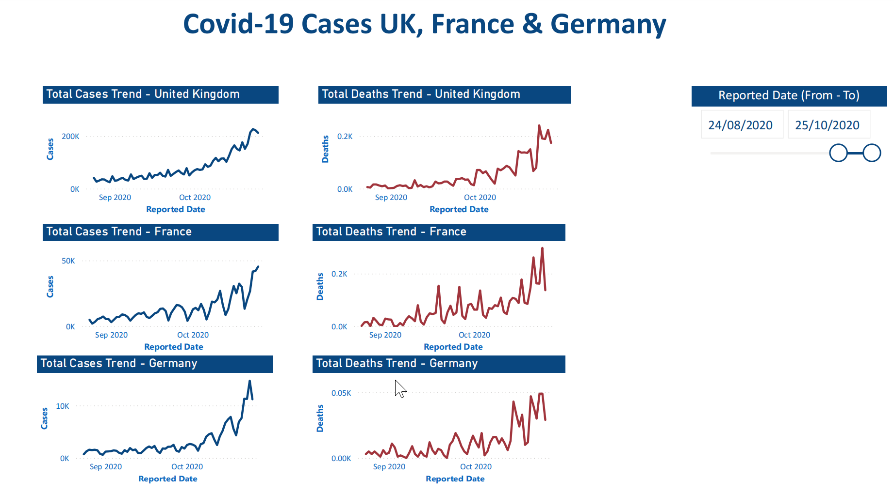
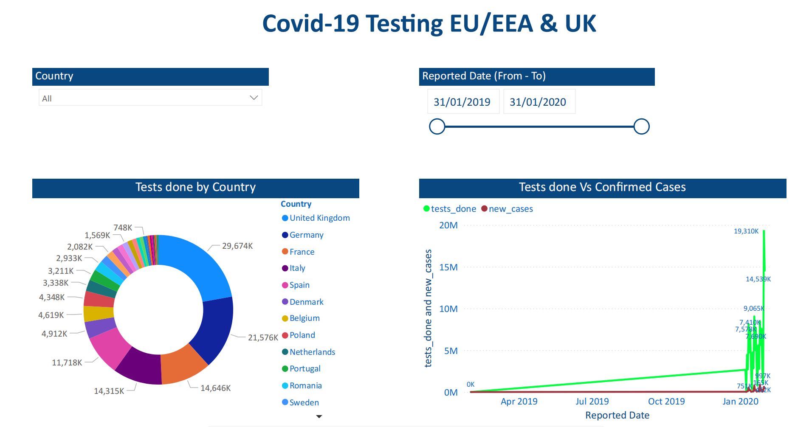

# covid19-adf

## Overview
This project analyzes the spread and impact of COVID-19 across European countries using publicly available datasets. It aims to extract insights through data preprocessing, visualization, and time-series analysis.

## Table of contents
- [covid19-adf](#covid19-adf)
  - [Overview](#overview)
  - [Table of contents](#table-of-contents)
  - [Architecture](#architecture)
  - [Project Structure](#project-structure)
  - [Data Source](#data-source)
  - [Tech Stack](#tech-stack)


## Architecture
<p align="center">
    
    </br>
  Project Architecture
</p>

## Project Structure
```shell
.
├── assets/
├── dataflow/           
├── dataset/             
├── factory/
├── linkedService/
├── pipeline/
├── trigger/
├── publish_config.json
└── README.md
```

## Data Source
https://www.ecdc.europa.eu/en

## Tech Stack
1. Azure Data Factory
<p align="center">
    
    </br>
    
    </br>
    
    </br>
  Dataflow
</p>

2. Databricks
<p align="center">
    
    </br>
  Databricks
</p>

3. Azure Data Lake Gen 2
<p align="center">
    
    </br>
  Azure Data Lake Gen 2
</p>

4. Azure SQL Database
<p align="center">
    
    </br>
  Azure SQL Database
</p>

5. Power BI
<p align="center">
    
    </br>
    
    </br>
  Covid Trends by Country
</p>

<p align="center">
    
    </br>
  Covid Testing Cases
</p>

